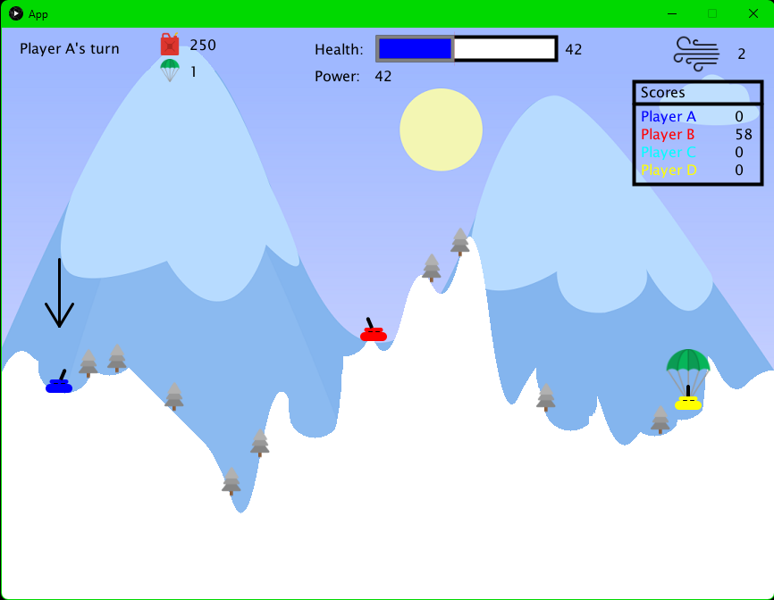

# Tanks

**INFO1113 - Object-Oriented Programming**  
The University of Sydney  
12 May 2024

<mark>**Academic Integrity:** The use of AI tools is not permitted for this assignment.</mark>

A turn-based artillery game built with Java and Processing.

## Overview

Tanks is a multiplayer artillery game where players take turns controlling tanks to destroy opponents. The game features terrain destruction, wind effects, and multiple themed levels.



## Table of Contents

- [Features](#features)
- [Requirements](#requirements)
- [Building](#building)
- [Running](#running)
- [Testing & Code Coverage](#testing--code-coverage)
- [Controls](#controls)
- [Gameplay](#gameplay)
- [Configuration](#configuration)
- [Project Structure](#project-structure)

## Features

- **4 Players** - Compete as Player A, B, C, or D
- **3 Themed Levels** - Snow, desert, and grass environments
- **Unlimited Mode** - Procedurally generated levels after completing the main game
- **Physics** - Wind affects projectile trajectory
- **Terrain** - Smoothed terrain with destructible elements
- **Power-ups** - Fuel and parachutes for tank mobility

## Requirements

- Java 8 or higher
- Gradle 5.6+

## Building

```bash
./gradlew build
```

## Running

```bash
./gradlew run
```

Or run the built JAR:

```bash
java -jar build/libs/I22-1.0.jar
```

## Testing & Code Coverage

### Testing

Run the unit tests:

```bash
./gradlew test
```

### Code Coverage

Generate a JaCoCo coverage report:

```bash
./gradlew test jacocoTestReport
```

The HTML report is generated at `build/reports/jacoco/test/html/index.html`.

## Controls

| Key                  | Action |
|----------------------|-----------------------------------------|
| Left/Right Arrow     | Move tank (consumes fuel)               |
| Up/Down Arrow        | Adjust turret angle                     |
| W/S                  | Adjust power                            |
| Space                | Fire projectile (ends turn)             |
| R                    | Repair kit (+20 health, costs 20 score) |
| F                    | Buy fuel (+200 fuel, costs 10 score)    |
| Space (end of level) | Next level                              |
| R (game over)        | Restart game                            |
| C (game over)        | Continue to unlimited levels            |

## Gameplay

- **Turn-based Combat**: Players take turns aiming and firing projectiles.
- **Scoring**: Damage and score are calculated based on distance from the explosion center.
- **Wind**: Wind speed and direction change randomly, affecting projectile trajectory.
- **Terrain**: Projectiles destroy terrain upon impact. Tanks take fall damage if terrain beneath them is destroyed.
- **Parachutes**: Automatically deployed if a tank falls, reducing damage. Limited supply per player.

## Configuration

Game settings are defined in `config.json`:
- Level layouts and backgrounds
- Player colors
- Tree sprites

Level layouts are defined in a 28x20 grid in text files (`level1.txt`, `level2.txt`, `level3.txt`):
- `X` - Terrain
- `T` - Tree
- `A` - `D` - Player spawn positions
- ` ` (Space) - Empty

Images referenced in `config.json` must exist under `src/main/resources/Tanks`.

## Project Structure

```
├── src/
│   ├── main/
│   │   ├── java/Tanks/
│   │   │   ├── App.java        # Main game application
│   │   │   ├── Tank.java       # Tank entity
│   │   │   └── Projectile.java # Projectile physics
│   │   └── resources/Tanks/    # Game assets (images)
│   └── test/java/Tanks/
│       └── SampleTest.java     # Unit tests
├── images/                     # Documentation images
├── build.gradle                # Build configuration
├── config.json                 # Game configuration
├── level*.txt                  # Level layouts
└── README.md
```
